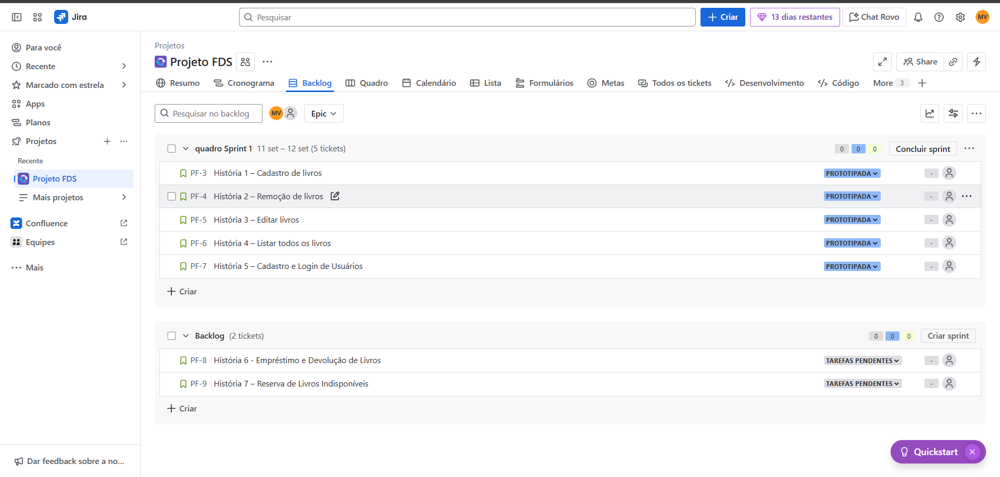

📌 Sobre o Projeto  
Sistema para organizar pequenos acervos de livros: cadastro, busca, controle de disponibilidade (disponível/emprestado) e gestão simples de empréstimos.  

| 🔖 Disciplina | Fundamentos de Desenvolvimento de Software |  

👥 Integrantes do Grupo: 

- Marco Antonio Veras Sanson e Souza
- João Cláudio Cavalcanti Beltrão Filho
- João Lucas de Oliveira Gonçalves Baima
- Luís Felipe Furlaneto Lima
- Juliana van der Linden Mota
- Vitória Souza Raposo Teixeira
 

🎯 Objetivo  
📚 Cadastrar e listar livros;  
🔍 Pesquisar e filtrar por título, autor ou status;  
✅ Controlar disponibilidade (disponível/emprestado);  
🌐 Publicar aplicação web responsiva em Django, com banco de dados (SQLite/PostgreSQL) e deploy na Azure.

## Entregas ✅

  
<strong>Entrega 01</strong>

   

  <!-- Links principais da entrega -->
  • **Histórias (Docs):**  [Docs](https://docs.google.com/document/d/1b9qbNjpCiyQE_ync4hT_Wn1JKFUz-lr83mvTd-sLNLU/edit?usp=sharing)  
  • **Jira (projeto/board):**  [Jira](https://projeto-fds-gp3.atlassian.net/jira/software/projects/SCRUM/boards/1/backlog)  
  • **Screencast (vídeo):** [Link para o youtube](https://www.youtube.com/watch?v=FVJNxlJSBmc)
  • **Figma:** [Figma](https://www.figma.com/design/VzZrdK6JLIkQFwWEWpDcdv/Biblox?node-id=0-1&t=VK82sCdZSHeBcCon-1 )
  

  <!-- Evidências (duas imagens do Jira) -->
  

    
  

  

    
  

